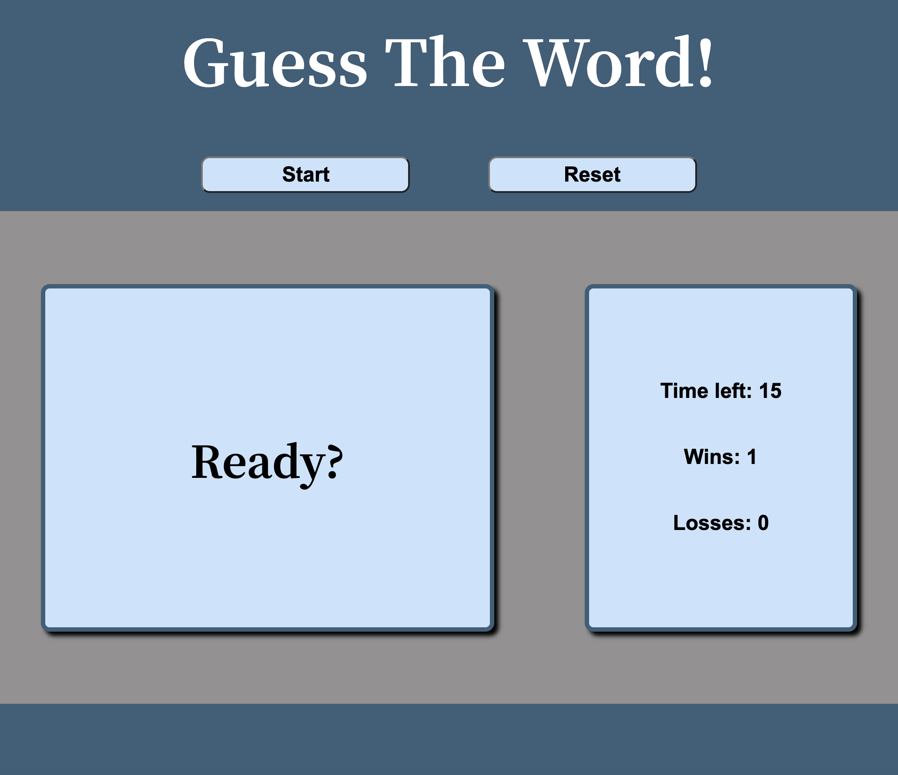
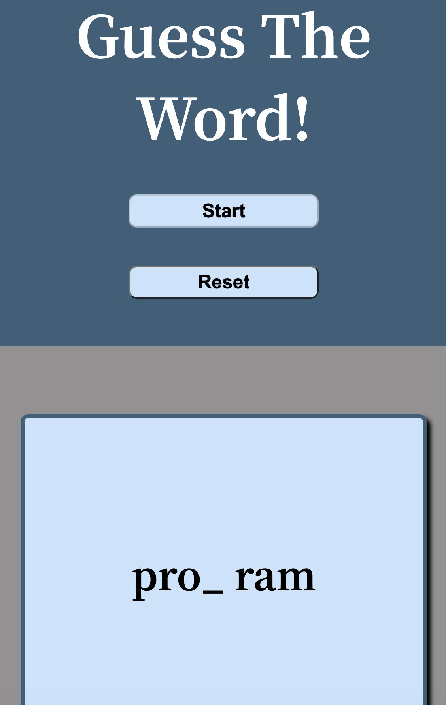

# Word Guess

## Description

To complete this project, I designed a JavaScript-based application that responds to user keydown events. When a user presses the start button, a random word from a word bank array is selected and an underscore is dynamically created for each letter of the word. When a user presses down on a correct key, the underscores are replaced with that letter. If the user guesses an incorrect key, nothing happens. The user receives feedback based on whether or not the word has been guessed within the given timeframe of 15 seconds. 

When a user wins or loses, this is recorded in the user's stats box. These values are saved in local storage so that when a user refreshes the page, their previous wins and losses persist. The user also has the option to reset wins and losses via a reset button, if desired.

By completing this project, I became more comfortable working with booleans, timers, array methods, for loops, template literals, and local storage. In one function, I used two for loops to replace underscores with correctly guessed letters. By running the second loop conditionally instead of nesting them, I kept the algorithm's runtime efficient.

I ran into one issue in which my timer would function properly the first time the application is played, but in subsequent times (after the user clicked the start button again without refreshing the page), the timer did not work. I realized that was because I needed to reset the userDidWin boolean back to false after the first round of the game.

Overall, the application was fairly straightforward to design and I particularly enjoyed becoming more confident with creating algorithms that respond to events that are different from the typical click or submit event.

Further ideas for development:

1. Providing feedback for when an incorrect letter is guessed

2. Giving the user the option to choose easy, medium, or difficult words to guess, with more difficult ones worth more points or, if a user wins a few times in a row, the words becomes progressively more difficult to guess

3. Add additional CSS animations to the stats box

Please find the deployed application here: https://vruss14.github.io/word-guess

## Installation

No installation steps are required to view this project. To view the front-end application, visit the URL above. The application's source code can be found on GitHub here: https://github.com/vruss14/word-guess.

## Usage

This web application is designed for all applications.

Below is a screenshot of the desktop version of the deployed application:

Below is a screenshot of the mobile version of the deployed application:

## Credits

Valerie Russell designed and created this webpage.
